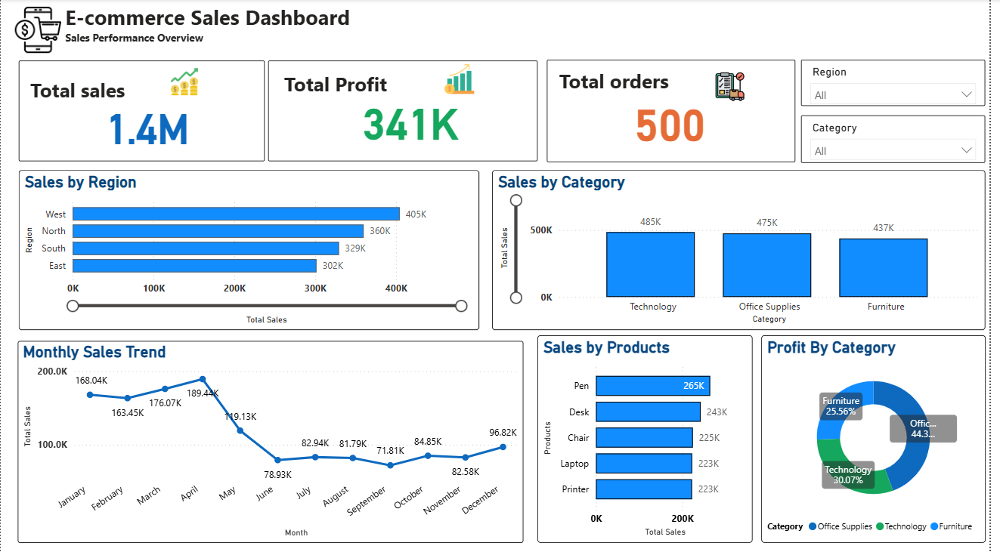
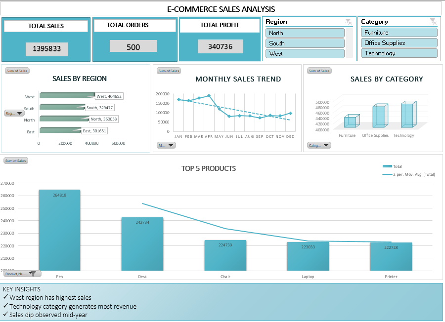

# E-commerce Sales Analysis Dashboard

## 📊 Project Overview
This project analyzes e-commerce sales data using Excel, SQL, and Power BI.

## 🛠 Tools Used
- Excel
- SQL
- Power BI

## 📈 Key Insights
- West region has highest sales
- Technology category performs best
- Sales increase in later months

## 📁 Files
- Dataset (CSV)
- SQL Queries
- Power BI Dashboard
- Excel file
- dashbord screenshots

## 📊 Power BI Dashboard

## 📊 Excel Dashboard

## 🚀 Outcome
Built an interactive dashboard for business insights.
