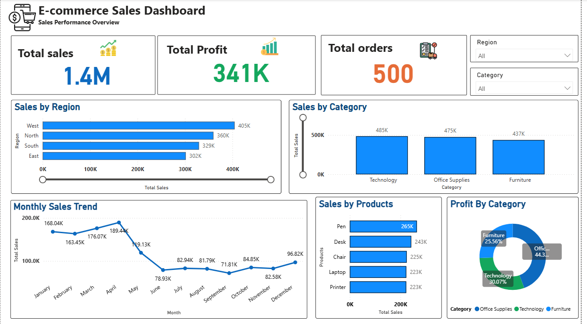
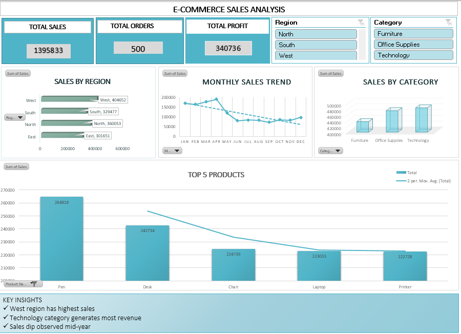

# 📊 E-Commerce Sales Analysis Dashboard

## 🚀 Project Overview
Developed an end-to-end E-Commerce Sales Analysis solution using SQL, Excel, and Power BI. The project focuses on analyzing sales performance, customer purchasing behavior, profitability, and business KPIs to support data-driven decision-making.

---

## 🛠️ Tools & Technologies
- SQL (Data Extraction & Analysis)
- Microsoft Excel (Data Cleaning & Validation)
- Power BI (Dashboard & Visualization)
- DAX Measures
- Data Modeling

---

## 📈 Key KPIs
✔ Total Sales Revenue  
✔ Total Orders  
✔ Profit Margin  
✔ Average Order Value  
✔ Customer Count  
✔ Top Performing Products  

---

## 🎯 Dashboard Features
- Interactive Power BI Dashboard
- Sales Trend Analysis
- Region-wise Performance Analysis
- Product Category Analysis
- Customer Insights
- Profitability Analysis
- Dynamic Filters and Slicers

---

## 💡 Business Insights
- Identified top-performing products and categories.
- Analyzed sales and profit trends across regions.
- Evaluated customer purchasing patterns.
- Highlighted revenue growth opportunities.
- Created interactive visualizations for business decision-making.

## 📊 Power BI Dashboard

## 📊 Excel Dashboard

 
